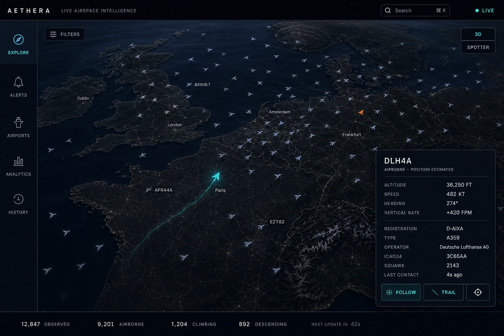
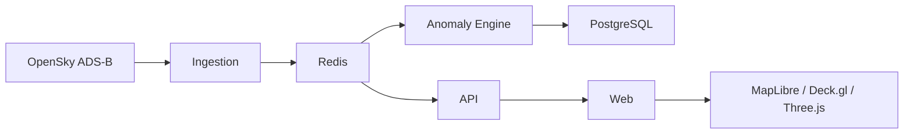

<div align="center">

# AETHERA

**Live Airspace Intelligence**

[](LICENSE)
[](#tech-stack)
[](#tech-stack)
[](#getting-started)

Real-time 3D airspace visualization. Observed aircraft, live telemetry, and unusual activity — presented as a premium product, not a generic radar dashboard.

[Features](#features) · [Architecture](#architecture) · [Getting started](#getting-started) · [Documentation](#documentation)

</div>

<p align="center">
  
</p>

<p align="center"><sub>Explore — live airspace, selected aircraft, interpolated motion between snapshots.</sub></p>

> Make complex airspace data feel simple, fast, precise, and beautiful.

The map and the aircraft *are* the experience. AETHERA turns ADS-B telemetry into a fast, immersive view of live airspace so you can inspect aircraft, follow trails, and spot unusual activity without drowning in chrome.

It presents aircraft and states that are **observable through its configured data sources**. It does not claim complete worldwide coverage.

---

## Features

Five surfaces, one product:

| Surface | What it does |
| --- | --- |
| **Explore** | Live 3D map, interpolated motion, search, filters, follow, and trails |
| **Alerts** | Anomaly and emergency-squawk detection with a followable feed |
| **Airports** | Airport traffic and surrounding activity |
| **Analytics** | Airspace statistics and patterns |
| **History** | Replay observed airspace as historical data accumulates |

Also included:

- Aircraft intelligence panel with telemetry and registry identity
- Spotter layer for category colours and rare types
- Realtime updates across the map and panels
- Backend-first pipeline — the browser never talks to OpenSky

---

## Architecture

AETHERA is backend-first. The browser never talks to OpenSky directly.



Ingestion polls and normalizes ADS-B state on a **credit budget** (OpenSky Standard: 4,000 `/states` credits per day). A global snapshot costs 4 credits, so the default poll is about **90 seconds**. Redis holds ephemeral live state. The client interpolates motion between snapshots. PostgreSQL persists flights, events, and history. The API serves queries and pushes realtime updates to the web client.

All infrastructure runs through Docker.

---

## Tech stack

| Layer | Choice |
| --- | --- |
| Frontend | Next.js, React, TypeScript, Tailwind CSS |
| Visualization | MapLibre GL JS, Deck.gl, Three.js |
| Backend | Node.js, TypeScript, Fastify |
| Database | PostgreSQL |
| Live state | Redis |
| Data source | OpenSky Network |
| Infrastructure | Docker Compose |
| Package manager | [pnpm](https://pnpm.io) |

---

## Getting started

**Requirements:** [Node.js 20+](https://nodejs.org) and [Docker Desktop](https://docs.docker.com/get-docker/) (or Docker Engine with Compose v2). Start Docker before setup. pnpm is enabled automatically via Corepack.

```bash
git clone https://github.com/schiessti-afk/AETHERA.git
cd AETHERA
node scripts/setup.mjs
pnpm dev
```

That is the whole install. Setup copies `.env`, installs packages, starts PostgreSQL and Redis, and applies migrations. Then open [http://localhost:3000](http://localhost:3000).

`pnpm dev` brings the infra up again if it is not already running.

| Service | URL |
| --- | --- |
| Web | http://localhost:3000 |
| API | http://localhost:3001 |
| Health | http://localhost:3001/health |
| PostgreSQL | localhost:55432 |
| Redis | localhost:6380 |

### OpenSky credentials (recommended)

The map and tiles need no API key. Live aircraft come from [OpenSky](https://opensky-network.org). Without credentials, ingestion still starts but OpenSky will usually rate-limit anonymous access.

1. Create an account at [opensky-network.org](https://opensky-network.org)
2. Create an OAuth client and copy the id and secret
3. Set `OPENSKY_CLIENT_ID` and `OPENSKY_CLIENT_SECRET` in `.env`
4. Restart `pnpm dev`

Standard accounts have **4,000 `/states` credits per day**. Leave `OPENSKY_POLL_INTERVAL_MS` at `90000` for global coverage, or set `OPENSKY_WEST/SOUTH/EAST/NORTH` to a small bbox to poll more often. See [Architecture §25](docs/ARCHITECTURE.md#25-rate-limit-protection).

Private provider credentials must never be exposed to the browser.

### Docker-only

If you do not want Node on the host:

```bash
git clone https://github.com/schiessti-afk/AETHERA.git
cd AETHERA
cp .env.example .env
docker compose up --build
```

Then open [http://localhost:3000](http://localhost:3000). Add OpenSky credentials to `.env` before starting if you want live traffic.

### Useful commands

| Command | What it does |
| --- | --- |
| `node scripts/setup.mjs` | First-time install (also `pnpm setup`) |
| `pnpm dev` | Web, API, and ingestion (starts Postgres/Redis if needed) |
| `pnpm migrate` | Apply SQL migrations |
| `pnpm docker:up` | Full stack in Docker |
| `pnpm docker:down` | Stop the full Docker stack |

### Troubleshooting

| Symptom | What to do |
| --- | --- |
| `Docker is installed but the daemon is not running` | Start Docker Desktop, wait until it is idle, then re-run setup |
| `pnpm` is not found after setup | Open a new terminal in the repo and run `pnpm dev` |
| Port 3000 or 3001 already in use | Stop the other process, then `pnpm dev` again |
| Map loads but no aircraft | Add OpenSky credentials to `.env` and restart |
| Schema / Postgres errors after `git pull` | `pnpm migrate` |

---

## Repository layout

```text
aethera/
├── apps/
│   ├── web/                 # Next.js client
│   └── api/                 # Fastify API and realtime gateway
├── packages/
│   ├── types/
│   ├── validation/
│   ├── flight-engine/
│   ├── anomaly-engine/
│   └── ui/
├── services/
│   └── ingestion/           # OpenSky polling and normalization
├── database/
│   ├── migrations/
│   └── seeds/
├── docker/
├── docs/
├── scripts/
│   └── setup.mjs            # clone-to-run bootstrap
├── docker-compose.yml
├── package.json
└── README.md
```

---

## Documentation

These documents are the source of truth for their respective areas.

| Document | Purpose |
| --- | --- |
| [Product Specification](docs/PRODUCT_SPEC.md) | Product requirements, positioning, and application structure |
| [Design System](docs/DESIGN_SYSTEM.md) | Visual language, UI, and interaction principles |
| [Architecture](docs/ARCHITECTURE.md) | Technical architecture, data flow, and system design |
| [Roadmap](docs/ROADMAP.md) | Four-phase delivery sequence for the product surfaces |

---

## Principle

Build AETHERA as a premium visualization product, not a dashboard.

The map and aircraft are the experience.

Fast. Precise. Atmospheric. Beautiful.

---

## License

Released under the [MIT License](LICENSE).
