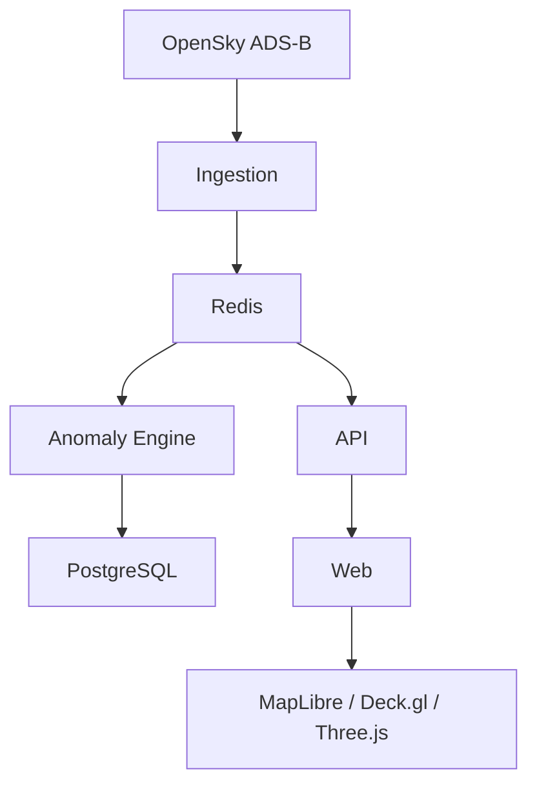

# AETHERA

**Live Airspace Intelligence**

[](LICENSE)

AETHERA is a real-time 3D airspace visualization platform. It turns observed aircraft telemetry into a fast, immersive experience for exploring live airspace and spotting unusual flight activity.

It is built as a premium visualization product, not a generic radar dashboard. The map and the aircraft *are* the experience.

> Make complex airspace data feel simple, fast, precise, and beautiful.

AETHERA presents aircraft and states that are **observable through its configured data sources**. It does not claim complete worldwide coverage.

---

## Features

- Live visualization of observed airspace
- Interactive 3D aircraft tracking
- Real-time telemetry
- Aircraft search and filtering
- Flight trails and movement interpolation
- Anomaly and emergency-squawk detection
- Aircraft intelligence panel
- Airport traffic views
- Airspace analytics
- Historical exploration as data becomes available
- Realtime updates across the map and panels

The application is organized around five surfaces: **Explore**, **Alerts**, **Airports**, **Analytics**, and **History**.

---

## Architecture

AETHERA is backend-first. The browser never talks to OpenSky directly.

```text
OpenSky
   ↓
Ingestion
   ↓
Redis
   ↓
API  +  Anomaly Engine
   ↓         ↓
Realtime     PostgreSQL
   ↓
Web  —  MapLibre / Deck.gl / Three.js
```



Ingestion polls and normalizes ADS-B state on a **credit budget** (OpenSky Standard: 4,000 `/states` credits per day). A global snapshot costs 4 credits, so the default poll is about **90 seconds**. Redis holds ephemeral live state. The client interpolates motion between snapshots. PostgreSQL persists flights, events, and history. The API serves queries and pushes realtime updates to the web client. The visualization layer renders airspace in 2D and 3D.

All infrastructure runs through Docker.

---

## Tech stack

| Layer | Choice |
| --- | --- |
| Frontend | Next.js, React, TypeScript, Tailwind CSS |
| Visualization | MapLibre GL JS, Deck.gl, Three.js |
| Backend | Node.js, TypeScript, Fastify |
| Database | PostgreSQL |
| Live state | Redis |
| Data source | OpenSky Network |
| Infrastructure | Docker Compose |
| Package manager | pnpm |

---

## Documentation

These documents are the source of truth for their respective areas.

| Document | Purpose |
| --- | --- |
| [Product Specification](docs/PRODUCT_SPEC.md) | Product requirements, positioning, and application structure |
| [Design System](docs/DESIGN_SYSTEM.md) | Visual language, UI, and interaction principles |
| [Architecture](docs/ARCHITECTURE.md) | Technical architecture, data flow, and system design |
| [Roadmap](docs/ROADMAP.md) | Four-phase delivery sequence for the product surfaces |

---

## Getting started

### Requirements

- Docker and Docker Compose
- Node.js
- [pnpm](https://pnpm.io)

### Setup

```bash
git clone <repository-url>
cd AETHERA

pnpm install
cp .env.example .env

docker compose -f docker-compose.dev.yml up -d
pnpm dev
```

This starts PostgreSQL and Redis in Docker, then the web, API, and ingestion processes on the host.

- Web: http://localhost:3000
- API: http://localhost:3001
- Health: http://localhost:3001/health
- PostgreSQL: localhost:55432
- Redis: localhost:6380

Configure OpenSky OAuth client credentials (`OPENSKY_CLIENT_ID`, `OPENSKY_CLIENT_SECRET`) and database settings in `.env` before starting. The map uses MapLibre with OpenFreeMap tiles and does not need an API key. Private provider credentials must never be exposed to the browser.

Standard OpenSky accounts have **4,000 `/states` credits per day**. Leave `OPENSKY_POLL_INTERVAL_MS` at `90000` for global coverage, or set `OPENSKY_WEST/SOUTH/EAST/NORTH` to a small bbox to poll more often. See [Architecture §25](docs/ARCHITECTURE.md#25-rate-limit-protection).

---

## Repository layout

```text
aethera/
├── apps/
│   ├── web/                 # Next.js client
│   └── api/                 # Fastify API and realtime gateway
├── packages/
│   ├── types/
│   ├── validation/
│   ├── flight-engine/
│   ├── anomaly-engine/
│   └── ui/
├── services/
│   └── ingestion/           # OpenSky polling and normalization
├── database/
│   ├── migrations/
│   └── seeds/
├── docker/
├── docs/
├── docker-compose.yml
├── package.json
└── README.md
```

---

## Principle

Build AETHERA as a premium visualization product, not a dashboard.

The map and aircraft are the experience.

Fast. Precise. Atmospheric. Beautiful.

---

## License

Released under the [MIT License](LICENSE).
